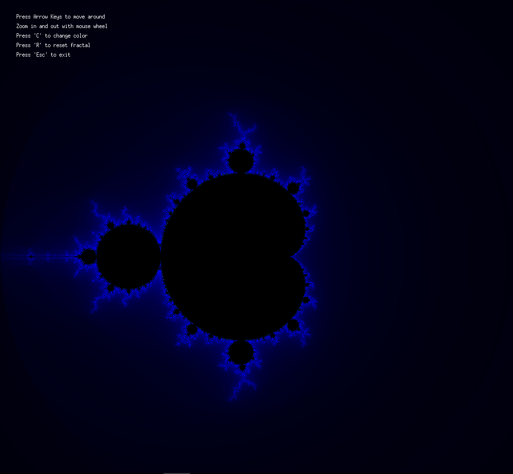
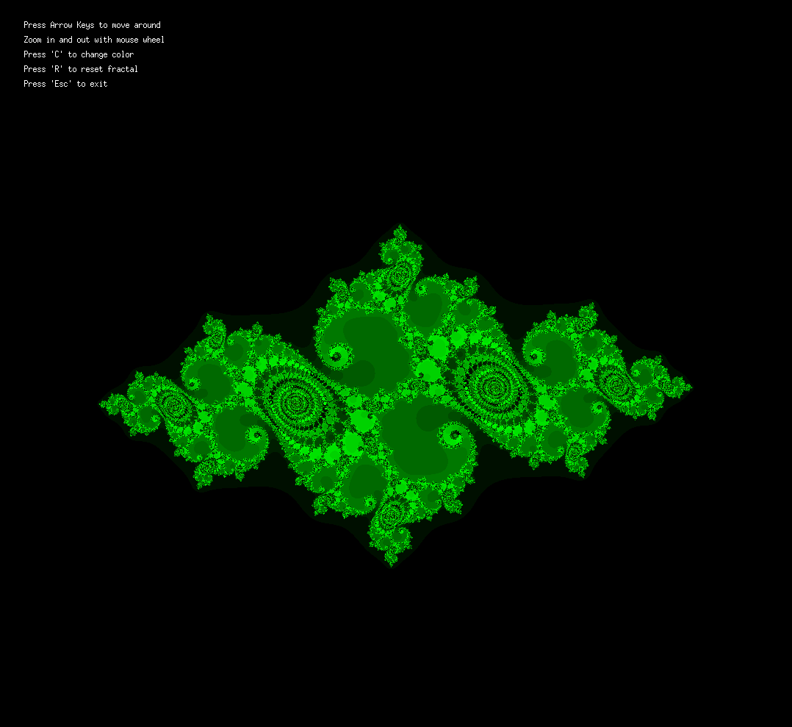
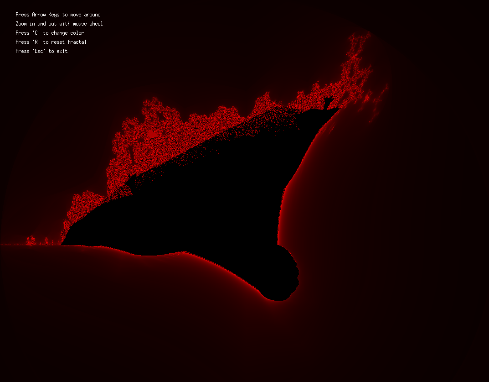

# fract-ol

This Project made me discover 2D programming and the psychedelic (and very complex) universe of fractals in this project, using minilibX.

## Result

[](https://github.com/JaeSeoKim/badge42)

## Installation process

**To clone correctly use:**

```
git clone --recurse-submodules https://github.com/Scelfo42/fract-ol.git
```

Then make sure that you have all the dependencies needed for minilibx, if you are not sure, check <a target="_blank" href="https://harm-smits.github.io/42docs/libs/minilibx/getting_started.html#installation">here</a> on how to install them.

If you are wondering what fractals are, well here there are mines:

**MANDELBROT:**

Mandelbrot</img>

**JULIA:**

Julia</img>

**BURNINGSHIP:**

Burningship</img>

Good luck!😈
